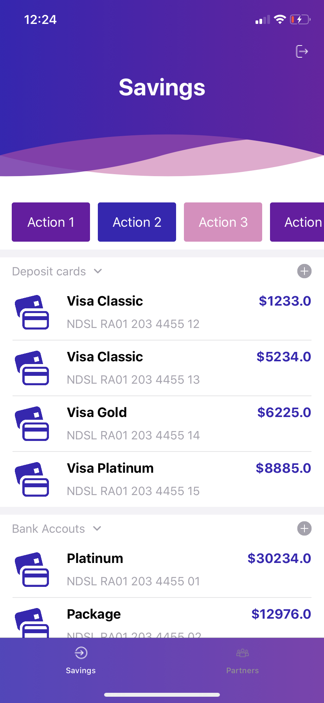
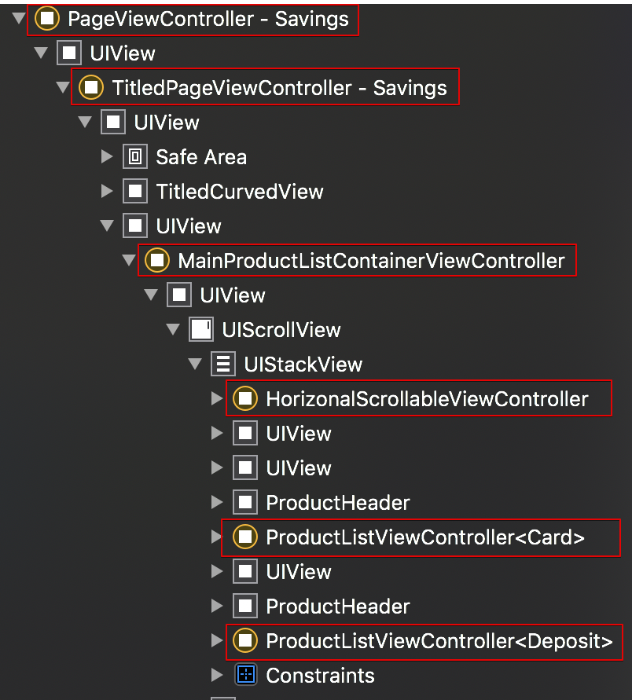
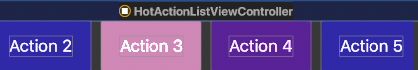
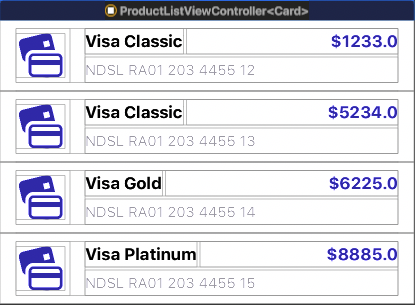

# MVC - как подход с дочерними контроллерами

Мы не используем верстку сценариев с помощью [Storyboards](https://developer.apple.com/library/archive/documentation/ToolsLanguages/Conceptual/Xcode_Overview/DesigningwithStoryboards.html)

В проектах мы используем Model View Controller (MVC) архитектуру с дочерними контроллерами, каждый из которых использует свой `xib` файл (при необходимости).


## Child View Controller

`UIViewController` (child) может быть добавлен в другой `UIViewController` для формирования иерархии. Это позволяет составлять UI из нескольких блоков, что упрощает чтение/поддержку кода и добавляет возможность его повторного использования:

```
    func addChildViewController(_ child: UIViewController) {
        addChild(child)
        view.addSubview(child.view)
        child.didMove(toParent: self)
    }
```

Рассмотрит данный подход на примере главного экрана:



Данный экран построен как композиция `UIViewController`-ов:

```
MainProductListContainerViewController
    │
    └───HorizontalScrollableContainerViewController
    │   │
    │   └───HotActionListViewController
    │
    └───ProducltListViewController<Card>
    │
    └───ProducltListViewController<Deposit>
```        

Эту композицию можно наблюдать используя [Debug View Hierarchy](https://developer.apple.com/library/archive/documentation/DeveloperTools/Conceptual/debugging_with_xcode/chapters/special_debugging_workflows.html#//apple_ref/doc/uid/TP40015022-CH9-SW2):



Здесь:
* `MainProductListContainerViewController` - [контейнер контроллер](#container-controller), который может отобразить ZeroScreen(экран, сообщающий что что-то пошло не так и получить данные не удалось) в случае ошибки.
* `HorizontalScrollableContainerViewController` - контейнер контроллер, задающий скролируемое поведение для child контроллера.
* `HotActionListViewController` - контроллер с UI. Представлен панелью с кнопками:

    
* `ProducltListViewController<Card>` - контроллер с UI. Представлен списком карт пользователя:

    
* `ProducltListViewController<Deposit>` - контроллер с UI. Представлен списком счетов пользователя. Аналогичен - `ProducltListViewController<Card>`

### Передача данных между родительскими и дочерними контроллерами

Родительский контроллер загружает данные, передает их в дочерние. Дочерние контроллеры отображают данные, обрабатывают действия пользователя и взаимодействуют с родителем через делегаты ([Протоколы в Swift](https://docs.swift.org/swift-book/LanguageGuide/Protocols.html)) или замыкания.

## Структура папок

Рассмотрим также на примере главного сценария.

```
Savings
│
├── AddCard
│
├── AddDeposit
│
└── ProductList
    │
    ├── HotActions
    │   │
    │   ├── View
    │   │
    │   └── View Controller
    │
    └── ProductList
        │
        ├── View
        │
        └── View Controller
```

Здесь каталог `Savings` представляет собой главный сценарий, который представлен тремя экранами, каждый из который находтся в своем каталоге на уровне ниже:
* `ProductList` - главный экран, который мы рассмотрели [выше](#child-view-controller).
* `AddCard` - экран регистрации новой карты.
* `AddDeposit` - экран регистрации нового счета.

## Model View Controller

[Model-View-Controller (MVC)](https://developer.apple.com/library/archive/documentation/General/Conceptual/DevPedia-CocoaCore/MVC.html) - схема разделения данных приложения, пользовательского интерфейса и управляющей логики на три отдельных компонента: `Model`, `View` и `Controller` — таким образом, что модификация каждого компонента может осуществляться независимо.

Примерная структура папок для MVC:
```
<Экран>
│
└── View
│
├── View Model
│
└── View Controller
```

* `View` - Каталог с набором `UIView`, необходимых для построениях данного экрана.
* `View Model` - это не модель, которую нам представляет APIClient или локальная база(Core Data, Realm), а подготовленный отдельный объект, который необходим для отображения
* `View Controller` - содержит `UIViewController` swift и xib-файлы.

`Model` - модель бизнес логики, необходимая для функционирования экрана. Находится в каталоге `OmegaBank.Sources.Models` [вне](./structure.md#структура_на_примере_omegabank) каталога экрана.

## Container Controller

Отдельный вид контроллеров, функция которых - контейнеризация других контроллеров.

Например нам нужно реализовать следующий сценарий отображения списка элементов. В случае ошибки мы хотим отобразить ZeroScreen, который будет иметь кнопку повтора запроса.

В таком кейсе как раз нам и понадобится `Container Controller`.
Он будет содержать в себе либо child контроллер со списком элементов, либо child контроллер с ZeroScreen. Примером такого контроллера является `MainProductListContainerViewController`.